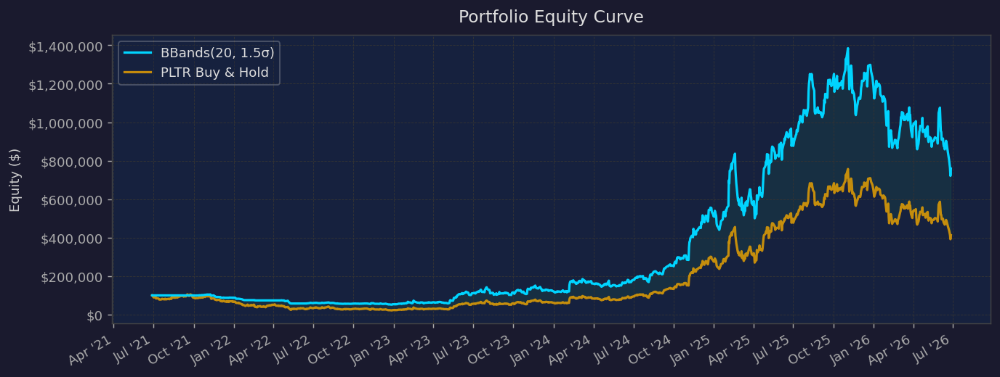

# Stock Backtester

> 以 Python 從零打造的 **event-driven** 美股回測系統，支援 multi-position、dynamic stop-loss 與自動產生 HTML 報告。
> 用來對 8 種 trading strategies × 15 檔美股 × daily / hourly 兩種頻率做系統性的 strategy research。


*PLTR — BBands(20, 1.5σ) daily, 2021–2026：strategy（藍）vs. Buy & Hold（橘）*

---

## Features

| 功能 | 說明 |
|------|------|
| **Event-driven Engine** | Bar-by-bar 模擬，依序處理 stop-loss → trailing stop → signal → order execution，避免 look-ahead bias |
| **Realistic Fills** | Stop 以當根 bar 的 High / Low 判斷觸發，若 gap 跳空則以 Open 成交；預設 0.1% slippage |
| **Multi-position** | Slot-based position tracking（`dict[slot_id, OpenPosition]`），同一檔股票可同時持有多個獨立部位，每個 slot 有各自的 stop / trailing 狀態 |
| **Dynamic Stop-loss** | 兩種觸發模式：獲利達 N%（percentage-based），或價格觸及 strategy 指定的價位（如 Bollinger upper band）；觸發後 hard stop 自動升級為 trailing stop |
| **Risk Management** | Fixed-fractional / risk-per-trade position sizing、ATR-based stop、max positions、max exposure、daily loss limit |
| **Performance Metrics** | Total / Annualized Return、Sharpe、Sortino、Calmar、Max Drawdown 與持續時間、Win Rate、Profit Factor、Expectancy、Alpha vs. Buy & Hold；自動偵測 bar frequency 做正確的 annualization |
| **HTML Report** | 單一檔案、自包含（charts 以 base64 PNG 嵌入）：Equity Curve、Drawdown、Monthly Returns Heatmap、Trade List |
| **Data Caching** | 透過 yfinance 下載 OHLCV 並以 CSV cache，避免重複請求 |

---

## Architecture

```
main.py (CLI)
   │
   ├─► data/fetcher.py          下載 + cache OHLCV（yfinance）
   │
   ├─► strategies/*.py          generate_signals(df) → signal ∈ {1, -1, 0}（+ optional trigger_price）
   │
   ├─► engine/backtester.py     bar-by-bar simulation
   │      ├─ engine/portfolio.py   slot-based positions、cash、equity curve、trade records
   │      └─ engine/risk.py        position sizing、stops、dynamic trailing、portfolio guards
   │
   └─► analysis/metrics.py      performance metrics
       analysis/report.py       self-contained HTML report
```

所有 strategy 繼承 `BaseStrategy`，只需實作 `generate_signals(df)`，engine 與 strategy 完全解耦，新增 strategy 不需動到 engine。

### Strategies

| CLI name | Strategy | 類型 |
|----------|----------|------|
| `sma` | SMA Crossover | Trend-following |
| `macd` | MACD Crossover | Trend-following |
| `donchian` | Donchian Channel Breakout | Trend-following |
| `rsi` | RSI Mean Reversion | Mean reversion |
| `bbands` | Bollinger Bands（lower band 進場，upper band 觸發 trailing stop） | Mean reversion + trend riding |
| `rsi_bb` | RSI + Bollinger Bands 雙重確認 | Mean reversion |
| `volspike` | Volume Spike Capitulation Reversal | Event-driven reversal |
| `dca` | Dollar-Cost Averaging | Benchmark |

---

## Usage

```bash
pip install -r requirements.txt
```

```bash
python main.py --ticker PLTR --start 2021-06-28 --end 2026-06-28 --strategy bbands --bb-period 20 --bb-std 1.5 --position-fraction 0.20 --max-positions 5 --stop-loss 0.05 --trailing-after-profit 0.03 --output reports/pltr_bb20_daily.html
```

```bash
python main.py --ticker SMCI --start 2024-06-28 --end 2026-06-28 --interval 1h --strategy donchian --position-fraction 0.20 --max-positions 5 --output reports/smci_donchian_1h.html
```

```bash
python gen_summary.py
```

`gen_summary.py` 會解析 `reports/` 下所有報告，彙整成 [`SUMMARY.md`](SUMMARY.md)。批次實驗見 [`run_all.py`](run_all.py)、[`run_explore.py`](run_explore.py)。

---

## Research Findings

共跑了數百組 ticker × strategy × parameter × frequency 組合（daily 5 年、hourly 2 年），完整結果見 [`SUMMARY.md`](SUMMARY.md)，被淘汰的組合與原因記錄在 [`TESTED_LOG.md`](TESTED_LOG.md)。

### 代表性結果（20% per trade，最多 5 個 concurrent positions）

| Ticker | Strategy | Freq | Return | Buy & Hold | Alpha | Sharpe | Max DD | Trades |
|--------|----------|------|-------:|-----------:|------:|-------:|-------:|-------:|
| PLTR | BBands(20, 1.5σ) | Daily | 658.8% | 312.5% | +346.4% | 1.18 | -50.7% | 30 |
| RKLB | BBands(10, 1.5σ) | Daily | 911.2% | 672.1% | +239.1% | 1.15 | -72.7% | 36 |
| COIN | BBands(20, 1.0σ) | Daily | 107.3% | -39.6% | +146.8% | 0.60 | -65.1% | 31 |
| HOOD | BBands(10, 1.5σ) | Daily | 327.3% | 183.4% | +143.8% | 0.92 | -62.7% | 46 |
| SMCI | Donchian(20/10) | 1h | 31.7% | -64.9% | +96.7% | 1.28 | -30.2% | 101 |

### 觀察
- **Strong-trend stocks 上 Buy & Hold 幾乎無法被打敗**：NVDA、VOO、AMD、TSLA 上所有 active strategies 都是 negative alpha。
- **BBands daily 是最穩定的 alpha 來源**，在 10 檔股票上都有正 alpha。但它的 win rate 只有約 10%、平均持有約 180 天，profit factor 高達 10 以上：本質是「逢低分批進場 + trailing stop 抱住大趨勢」的 fat-tail payoff，而非高勝率交易。
- **RSI mean reversion** 只在高波動、無明顯趨勢的標的（COIN、SMCI、MARA、MSTR）的 hourly 上有效，在 trending stocks 上全面失效。
- **Hourly BBands** 因雜訊多、false signals 多，大多失敗（INTC 例外）。

### Limitations
這些結果是 **in-sample** 的 parameter sweep，尚未做 out-of-sample 驗證，需要謹慎解讀：
- **Selection bias / multiple testing**：從大量組合中挑出最好的結果，報表上的 Sharpe 會被高估；下一步計畫以 **Deflated Sharpe Ratio** 與 **walk-forward analysis** 修正。
- **Survivorship bias**：測試標的是事後挑選的熱門股。
- **Execution assumptions**：signal 以當根 bar close 成交，未考慮 market impact；hourly 資料受 Yahoo Finance 約 730 天的限制。
- Max Drawdown 普遍在 50–70%，風險調整後的表現（Calmar < 1）遠不如 total return 亮眼。

---

## Project Structure

```
backtester/
├── main.py                 CLI entry point
├── config.py               default parameters
├── data/fetcher.py         yfinance download + CSV cache
├── engine/
│   ├── backtester.py       event-driven simulation loop
│   ├── portfolio.py        slot-based portfolio & trade records
│   └── risk.py             sizing, stops, dynamic trailing, guards
├── strategies/             8 strategies (all inherit BaseStrategy)
├── analysis/
│   ├── metrics.py          performance metrics
│   └── report.py           HTML report generator
├── gen_summary.py          aggregate reports → SUMMARY.md
├── run_*.py                batch experiment scripts
├── SUMMARY.md              all backtest results
└── TESTED_LOG.md           rejected combinations & reasons
```

## Tech Stack
Python · pandas · NumPy · matplotlib · yfinance

*開發過程中使用 Claude Code 輔助程式撰寫。*
